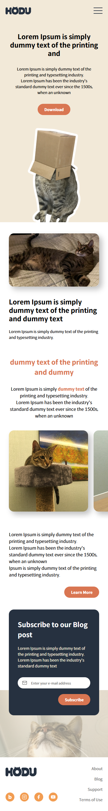
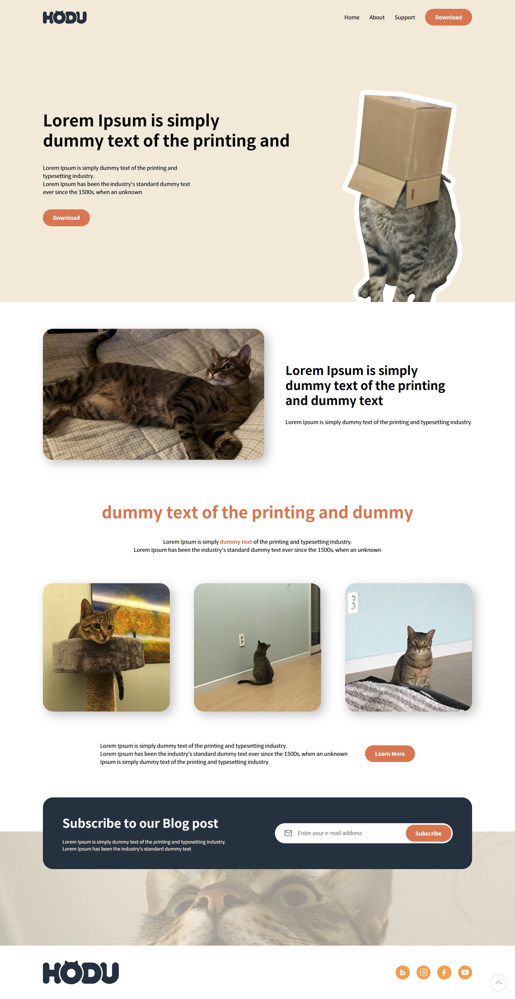
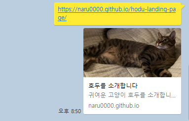

# 🐱 HODU 랜딩페이지

> **"귀여운 호두를 보세요"**

고양이 호두(HODU)를 소개하는 반응형 랜딩페이지입니다. PC First 방식으로 개발하여 큰 화면부터 작은 화면으로 대응하는 방식을 학습했습니다.

## 📖 프로젝트 소개

다양한 섹션과 인터랙션 요소가 포함되어 있는 랜딩페이지입니다.

-   헤더 네비게이션 (스크롤시 고정)
-   메인 배너 섹션
-   소개 및 갤러리 섹션
-   구독 신청 폼 및 모달
-   스크롤 탑 버튼

## 🛠 기술 스택

-   **HTML5** - 시맨틱 마크업, 접근성 고려
-   **CSS3** - PC 퍼스트 반응형 디자인
-   **BEM** - CSS 네이밍 컨벤션
-   **순수 CSS** - input 체크박스를 이용한 햄버거 메뉴
-   **반응형 이미지** - srcset을 이용한 이미지 최적화

## 📱 반응형 구현

| 디바이스 | 브레이크포인트 | 특징                       |
| -------- | -------------- | -------------------------- |
| 모바일   | ~767px         | 햄버거 메뉴, 세로 레이아웃 |
| 데스크톱 | 768px~         | 가로 네비게이션, 큰 폰트   |

-   '1만 시간의 법칙'의 기존 모바일 퍼스트와 반대 방식을 해보고 싶어 **PC 퍼스트 방식으로 변경**하여 큰 화면부터 디자인하고 `max-width` 미디어쿼리로 모바일 레이아웃을 만들었습니다. 태블릿 중간 단계 없이 768px 하나의 브레이크포인트로 반응형을 구현했습니다.

## ✨ 주요 기능

-   🔄 **헤더 스크롤 고정** (Sticky 포지션)
-   🍔 **순수 CSS 햄버거 메뉴** (체크박스 활용)
-   📱 **반응형 이미지 최적화** (srcset, sizes 속성)
-   🎯 **가로 스크롤 갤러리** (모바일,overflow 활용)
-   📧 **구독 폼 및 모달** (현재 UI만 구현, JavaScript 구현 예정)
-   ⬆️ **스크롤 탑 버튼** (현재 스타일만 구현, JavaScript 구현 예정)
-   ♿ **웹 접근성** 고려 (.sr-only 클래스 활용)

## 📸 스크린샷

### 모바일



### 데스크톱



### SNS 공유시 썸네일



## 🔗 배포 링크

🌐 **Live Demo**: [[HODU 랜딩페이지](배포링크입력)]

## 📁 프로젝트 구조

```
HODU/
├── index.html
├── css/
│   ├── reset.css (커스텀)
│   └── style.css
├── images/
│   ├── logo.svg
│   ├── box-cat.png
│   ├── img_1.jpg, img_1@2x.jpg
│   ├── img_2.jpg, img_2@2x.jpg
│   ├── img_3.jpg, img_3@2x.jpg
│   ├── img_4.png, img_4@2x.png
│   ├── img_5.jpg
│   └── mail.svg
└── README.md
```

## 🚧 개발 과정 주요 이슈

### 1. **헤더 구조와 히어로 섹션 배치 문제**

처음에 헤더 안에 히어로 섹션을 넣으려 했으나, 시맨틱 구조상 잘못되었다는 것을 깨달았습니다. 헤더는 네비게이션만 담당하고, 히어로 섹션은 main 태그 안에 배치하는 것이 올바른 방식임을 학습했습니다.

### 2. **Position Sticky vs Fixed 혼동**

스크롤시 헤더 고정 요구사항을 보고 처음에는 `position: fixed + JavaScript`로 구현하려 했으나, "처음에는 고정되지 않다가 스크롤시 고정"이라는 조건에 `position: sticky`가 더 적합함을 알게 되었습니다.

### 3. **순수 CSS 햄버거 메뉴 구현**

JavaScript 없이 햄버거 메뉴를 구현해야 하는 요구사항으로 **체크박스 핵** 방법을 학습했습니다. `input[type="checkbox"]`의 `:checked` 상태와 `~` 선택자를 조합하여 메뉴 토글을 구현했습니다. 애니메이션 제약은 있지만 `transition`으로 부드러운 효과를 적용할 수 있었습니다.

### 4. **Container 클래스 vs Main 태그 스타일링 혼동**

풀위드스 배경과 제한된 너비 콘텐츠를 동시에 구현할 때, `main` 태그에 직접 `max-width`를 주려 했으나 풀위드스 섹션에서 문제가 발생했습니다. `.container` 클래스를 별도로 만들어 필요한 곳에만 적용하는 방식이 더 유연함을 배웠습니다.

### 5. **폼 구조와 웹 접근성**

`label` 태그 안에 `button`을 넣는 것이 웹 접근성에 좋지 않다는 것을 학습했습니다. label은 입력 요소와의 연결만 담당해야 하고, 버튼은 별도로 분리하는 것이 올바른 마크업임을 깨달았습니다.

### 6. **반응형 이미지 최적화의 현실적 적용**

`srcset`과 `sizes` 속성을 이용한 반응형 이미지 최적화를 시도했으나, 2x 이미지의 용량 문제(6MB)를 경험했습니다. 작은 이미지(1.5MB 이하)만 2x를 제공하고 큰 이미지는 1x만 사용하는 현실적인 최적화 전략을 수립했습니다.

### 7. **CSS 단축속성과 개별속성의 우선순위**

```css
background: url(...) no-repeat center;
background-color: white;
```

이런 코드에서 `background-color`가 덮어쓰이지 않는 이유를 학습했습니다. 단축속성 후에 개별속성을 쓰면 해당 속성만 재정의됨을 이해했습니다.

### 8. **SVG fill 속성 제어 문제**

`` 태그로 삽입한 SVG는 CSS로 `fill` 색상 제어가 불가능하다는 것을 깨달았습니다. SVG 파일 내부에 하드코딩된 `fill` 속성과 inline SVG 방식의 차이점을 학습했습니다.

### 9. **PC First vs Mobile First 개념 정립**

기존 모바일 퍼스트(`min-width`)에서 PC 퍼스트(`max-width`)로 방향을 바꾸면서 미디어쿼리 작성법과 사고방식의 차이를 체감했습니다. 디자인 시안에 따라 적절한 방식을 선택하는 것이 중요함을 학습했습니다.

## 💡 개발하며 배운 점

-   **시맨틱 마크업의 체계적 접근**: 헤더, 메인, 섹션의 역할을 명확히 구분하고 의미에 맞는 태그 사용의 중요성
-   **BEM 네이밍의 일관성**: `.gallery__slide`, `.gallery__item` 등 의미가 명확한 클래스명 작성 방법. 처음에는 각 요소마다 클래스를 주는 것이 번거로웠지만, 점점 사용하면서 코드 구조를 보기에 편리해지는 장점을 스스로 느끼게 되었습니다.
-   **CSS 변수의 실용적 활용**: 색상만 변수로 관리하고 폰트 사이즈는 직접 rem 값 사용이 더 효율적
-   **반응형 이미지 최적화의 현실적 접근**: 이론과 실제 적용 사이의 차이점과 용량 최적화 전략
-   **순수 CSS 인터랙션의 한계와 가능성**: JavaScript 없이도 구현 가능한 기능들과 그 제약사항
-   **웹 접근성 고려사항**: `.sr-only` 클래스 활용과 폼 구조의 올바른 마크업

## 🎯 향후 개발 계획

-   [ ] JavaScript로 스크롤 탑 버튼 기능 구현
-   [ ] 구독 폼 유효성 검사 및 모달창 인터랙션 구현
-   [ ] 헤더 스크롤 고정 시 배경색 변경 효과
-   [ ] 모바일 반응형 CSS 완성
-   [ ] 웹 접근성 및 SEO 최적화 보완

---

**개발 기간**: 2025.06.19 - 2025.06.20 (2일)  
**개발자**: [고우리]
