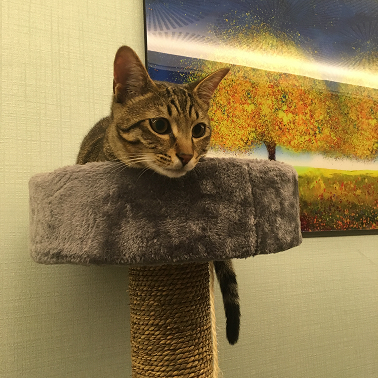

# 🐱 HODU 랜딩페이지

> **"귀여운 호두를 보세요"**

고양이 호두(HODU)를 소개하는 반응형 랜딩페이지입니다. PC 퍼스트 방식으로 큰 화면부터 작은 화면으로 대응하는 방식으로 개발했습니다.

## 📖 프로젝트 소개

다양한 섹션과 인터랙션 요소가 포함되어 있는 랜딩페이지입니다.

-   헤더 네비게이션 (스크롤시 고정)
-   메인 배너 섹션
-   소개 및 갤러리 섹션
-   구독 신청 폼 및 모달
-   스크롤 탑 버튼

## 🛠 기술 스택

-   **HTML5** - 시맨틱 마크업, 접근성 고려
-   **CSS3** - PC 퍼스트 반응형 디자인
-   **BEM** - CSS 네이밍 컨벤션
-   **순수 CSS** - input 체크박스를 이용한 햄버거 메뉴
-   **반응형 이미지** - srcset을 이용한 이미지 최적화

## 📱 반응형 구현

| 디바이스 | 브레이크포인트 | 특징                       |
| -------- | -------------- | -------------------------- |
| 모바일   | ~767px         | 햄버거 메뉴, 세로 레이아웃 |
| 데스크톱 | 768px~         | 가로 네비게이션, 큰 폰트   |

-   '1만 시간의 법칙'의 기존 모바일 퍼스트와 반대 방식을 해보고 싶어 **PC 퍼스트 방식으로 변경**하여 큰 화면부터 디자인하고 `max-width` 미디어쿼리로 모바일 레이아웃을 만들었습니다. 태블릿 중간 단계 없이 768px 하나의 브레이크포인트로 반응형을 구현했습니다.

## ✨ 주요 기능

-   🔄 **헤더 스크롤 고정** (Sticky 포지션)
-   🍔 **순수 CSS 햄버거 메뉴** (체크박스 활용)
-   📱 **반응형 이미지 최적화** (srcset, sizes 속성)
-   🎯 **가로 스크롤 갤러리** (모바일,overflow 활용)
-   📧 **구독 폼 및 모달** (현재 UI만 구현, JavaScript 구현 예정)
-   ⬆️ **스크롤 탑 버튼** (현재 스타일만 구현, JavaScript 구현 예정)
-   ♿ **웹 접근성** 고려 (.sr-only 클래스 활용)
-   🔍 **SEO 최적화** 적용

## 📸 스크린샷

### 데스크톱


### 모바일


### SNS 공유시 썸네일


## 🔗 배포 링크

🌐 **Live Demo**: [[HODU 랜딩페이지](https://naru0000.github.io/hodu-landing-page/)]

## 📁 프로젝트 구조

```
HODU/
├── index.html
├── css/
│   ├── reset.css
│   └── style.css
├── images/
│   ├── logo.svg
│   ├── box-cat.png
│   ├── img_1.jpg, img_1@2x.jpg
│   ├── img_2.jpg, img_2@2x.jpg
│   ├── img_3.jpg, img_3@2x.jpg
│   ├── img_4.png, img_4@2x.png
│   ├── img_5.jpg
│   └── mail.svg
└── README.md
```

## 🚧 개발 과정 주요 이슈

### 1. **헤더 구조와 메인 배너 섹션 배치 문제**

처음에 헤더 안에 메인 배너 섹션을 넣으려 했으나, 헤더는 네비게이션만 담당하고, 메인 배너 섹션은 main 태그 안에 배치하는 것이 올바른 방식임을 학습했습니다.

### 2. **Position Sticky vs Fixed 혼동**

요구사항을 읽고 처음에는 `position: fixed`로 고정을 주고, 헤더에 배경색을 투명으로 주어 배너 위에 헤더를 겹치게 하려는 생각이었습니다. 그러나 "처음에는 고정되지 않다가 스크롤시 고정"이라는 조건에 `position: sticky`가 더 적합하다 생각하였습니다. `sticky`는 `document-flow`(일반 위치,요소만큼 공간을 차지함)이기 때문에 헤더가 배너 섹션 위에 겹칠 수가 없어,헤더에 배너 섹션과 동일한 배경색을 주었습니다.

### 3. **순수 CSS 햄버거 메뉴 구현**

JavaScript 없이 햄버거 메뉴를 구현해보고자 여러 사례를 검색해보며 **체크박스** 방법을 사용했습니다. `input[type="checkbox"]`의 `:checked` 상태와 형제 선택자를 조합하여 메뉴 토글을 구현했습니다.

### 4. **Container 클래스**

레이아웃이 제한된 너비 콘텐츠와 full width 콘텐츠가 있어 `.container` 클래스를 별도로 만들어 PC 버전 기준 제한된 너비(1280px)는 필요한 곳에만 적용하였습니다.

### 5. **반응형 이미지 최적화 적용 가이드라인**

`srcset`과 `sizes` 속성을 이용한 반응형 이미지 최적화를 적용했습니다., 큰 이미지의 경우 2x 이미지의 용량 문제(6MB) 있어 작은 이미지(1.5MB 이하)만 2x를 제공하고 큰 이미지는 1x만 사용하기로 하였습니다.

```
    

    767px이하(모바일)에서는 이미지 너비를 100vw(화면 전체)로 사용하고,의외는 378px로 고정한다.
    브라우저에서는 378px과 756px의 너비의 이미지를 상황을 고려하여 최적의 이미지로 선택한다.

```

### 6. **SVG fill 속성 제어 문제**

`` 태그로 SVG 파일을 넣었는데, CSS로 `fill` 색상 변경이 안되는 문제가 있었습니다. 원인은 SVG 파일에 인라인 방식으로 `fill` 속성이 들어가있어서였고,인라인으로 들어간 `fill` 속성을 제거 후 CSS으로 적용하였습니다.

### 8. **PC First vs Mobile First **

모바일 퍼스트(`min-width`)에서 PC 퍼스트(`max-width`)로 방향을 바꾸면서 디자인 시안에 따라 적절한 방식을 선택하는 것이 중요함을 느꼈습니다.

## 💡 개발하며 배운 점

-   **반응형 이미지 최적화**: 반응형 이미지 최적화를 어떻게 할지 가이드라인을 잘 잡는게 중요
-   **순수 CSS 인터랙션**: JavaScript 없이도 구현 가능한 기능들이 있지만,제약이 있음
-   **웹 접근성 고려사항**: `.sr-only` 클래스 활용과 폼 구조의 올바른 마크업

## 🎯 향후 개발 계획

-   [ ] JavaScript로 스크롤 탑 버튼 기능 구현
-   [ ] 구독 폼 유효성 검사 및 모달창 인터랙션 구현

---

**개발 기간**: 2025.06.19 - 2025.06.20 (2일)  
**개발자**: [고우리]
